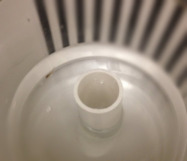

[Bolnick lab \| University of Connecticut]{style="color: teal; font-size: 15pt; font-weight: bold"}

Research in the [Bolnick lab](https://bolnicklab.wordpress.com) broadly focuses on ecology, evolution, and immunology. During my time as a tech (2018-2020), the lab's primary interest was the evolution of peritoneal fibrosis, an immune response some populations of threespine stickleback show in response to infection by *Schistocephalus solidus* tapeworms. I provided assistance on experiments, maintained the lab populations of stickleback, and was involved in a few data-analysis side projects ([Maciejewski et al. 2019, Evol. Ecol. Res.; Maciejewski et al. 2020, Evolution]{style="color: teal"}).

|  |  |  |
|:--:|:--:|:--:|
| *A copepod being screened for tapeworm infection. Schistocephalus are trophically transmitted to stickleback via copepods.* | *A stickleback with its tapeworm from an experimental infection.* | *Stickleback tagged with fluorescent elastomer for an immunity experiment.* |

[Bleakley lab \| Stonehill College]{style="color: teal; font-size: 15pt; font-weight: bold"}

The [Bleakley lab](https://www.smallcheerfulcreatures.org) uses guppies to study the evolution of cooperation and indirect genetic effects. As an undergraduate in the lab (2016-2018) I worked on various projects related to behavior and sensory ecology (eg. quantifying variation in lateral line morphology, measuring social learning and cooperation, and characterizing individual differences in responsiveness to visual and chemical sensory cues).

|  |  |
|:--:|:--:|
| *An antipredator assay with a model pike cichlid, used to quantify cooperative predator inspection behavior.* | *A small wildtype guppy in an optomotor assay, used to estimate visual acuity.* |

[Mullineaux lab \| Woods Hole Oceanographic Institution]{style="color: teal; font-size: 15pt; font-weight: bold"}

Research in the [Mullineaux lab](https://www2.whoi.edu/site/mullineauxlab/research/) focuses on marine larval dispersal and benthic ecology. As a Summer Student Fellow and Guest Student in the lab (2017-2018), I investigated the function of helical swimming behavior in oyster larvae. Many planktonic marine larvae swim in helices, however the function of this behavior is largely unknown. For my summer project, I tested whether helical swimming may serve as a feeding behavior and/or a response to conspecific chemical settlement cues ([Maciejewski et al. 2019, JEMBE]{style="color: teal"}).

|  |  |  |
|:--:|:--:|:--:|
| *Pipetting a sample of oyster larvae. Trials were conducted in a dark environmental chamber because larval swimming is influenced by light. Photo credit: Dr. Kirstin Meyer-Kaiser* | *Introducing oyster larvae into a flask to record swimming behavior. Larvae were slowly introduced via gravity to minimize water currents which could be mistaken for active swimming. Photo credit: Dr. Kirstin Meyer-Kaiser.* | *MATLAB plot tracking a single oyster larva swimming in a helix.* |

[Drew lab \| University of Massachusetts Dartmouth]{style="color: teal; font-size: 15pt; font-weight: bold"}

I joined the Drew lab for the summer of 2016 through a National Science Foundation Research Experience for Undergraduates. At the time, the lab was interested in the molecular mechanisms facilitating the mutualistic interaction between damselfishes and their host sea anemones. For my project, I used qPCR to compare the expression levels of a mucin-secretion gene (thought to facilitate the formation of a protective mucus layer on the skin of damselfish) in skin tissue from clownfish that were or were not associated with sea anemones.

| |
|:--:|
| *Clownfish with its host sea anemone.* |